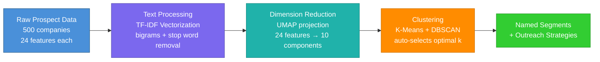
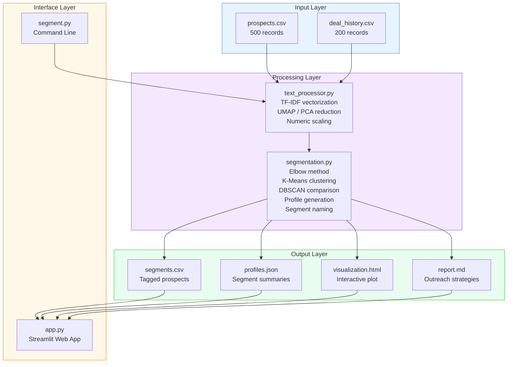

<div align="center">


# Audience Segmentation Tool

### Turn a messy spreadsheet of prospects into named, targetable audience segments — automatically.

*No manual tagging. No guesswork. Just data science applied to real sales problems.*

</div>

---

## What This Does

Imagine you have **500 prospects** in a spreadsheet — company descriptions, campaign histories, revenue figures, ad spend, social engagement scores. Right now, a human analyst would spend days reading through them, sorting them into groups, and writing outreach plans for each group.

**This tool does all of that in under 30 seconds.**

It reads your prospect data, understands the text using natural language processing, groups similar companies together using machine learning, then automatically names each group and writes a tailored outreach strategy for it.

**Before:** A flat list of 500 companies with no structure.
**After:** Clearly defined segments like *"Enterprise Finance Big Spenders"* and *"High-Spend Entertainment Brands"* — each with a profile, key stats, and a recommended approach for reaching them.

---

## The Problem It Solves

Sales teams waste hours manually sorting prospects. The groupings are inconsistent, subjective, and don't scale. When a new batch of prospects arrives, the whole process starts over.

This tool replaces that manual work with a **repeatable, data-driven pipeline** that:

- Finds patterns humans miss (text similarity, spending behavior, engagement levels)
- Produces consistent segments every time
- Scales from 500 to 50,000 prospects without additional effort
- Generates ready-to-use outreach strategies for each segment

---

## How It Works



**In plain English:**

1. **Read** the prospect spreadsheet (company descriptions, campaign notes, revenue, ad spend, social metrics)
2. **Understand** the text by converting words into numerical patterns (TF-IDF vectorization)
3. **Compress** the 24-feature dataset into a manageable shape (UMAP dimensionality reduction)
4. **Group** similar prospects together using clustering algorithms (K-Means finds the best number of groups; DBSCAN validates density)
5. **Name** each group automatically based on its dominant traits ("High-Spend Entertainment Brands")
6. **Write** outreach strategies tailored to each segment's characteristics

---

## Key Metrics

<div align="center">

| Metric | Value |
|:---|:---|
| Prospects analyzed | **500 companies** |
| Deal history records | **200 transactions** |
| Features per prospect | **24 (text + numeric + social)** |
| Text features extracted | **Up to 500 TF-IDF features per column** |
| Clustering methods | **K-Means (primary) + DBSCAN (validation)** |
| Optimal k selection | **Automatic via elbow method (k=2..15)** |
| Output formats | **CSV, JSON, interactive HTML, Markdown report** |

</div>

---

## Features

**Two Ways to Use It**

| Interface | Best For |
|:---|:---|
| **Command Line (CLI)** | Automated pipelines, batch processing, scheduled runs |
| **Streamlit Web App** | Exploring segments visually, presenting to stakeholders, interactive filtering |

**What You Get Out**

- **segments.csv** -- Every prospect tagged with a segment name
- **segment_profiles.json** -- Per-segment statistics (median revenue, top industry, campaign themes)
- **visualization.html** -- Interactive 2D scatter plot showing all clusters, color-coded
- **report.md** -- Full markdown report with tables, breakdowns, and outreach recommendations

---

## Architecture



```
audience-segmentation-tool/
├── data/
│   ├── prospects.csv            # 500 synthetic prospect records
│   └── deal_history.csv         # 200 historical deal records
├── pipeline/
│   ├── __init__.py
│   ├── text_processor.py        # TF-IDF + UMAP/PCA + numeric scaling
│   └── segmentation.py          # K-Means, DBSCAN, profile generation
├── results/                     # Generated by the pipeline
│   ├── segments.csv
│   ├── segment_profiles.json
│   ├── visualization.html
│   └── report.md
├── segment.py                   # CLI entry point
├── app.py                       # Streamlit viewer
├── generate_data.py             # Synthetic data generator
├── requirements.txt
└── README.md
```

---

## Sample Output

After running the pipeline, here is what a segment profile looks like:

### Segment: "Enterprise Finance Big Spenders"

| Attribute | Value |
|:---|:---|
| **Companies in segment** | 73 |
| **Dominant industry** | Financial Services |
| **Median annual revenue** | $48M |
| **Median ad spend** | $2.1M |
| **Top campaign themes** | Brand awareness, Q4 push, institutional trust |
| **Social engagement tier** | High (avg. 85th percentile) |
| **Revenue tier** | Enterprise |

**Auto-generated outreach strategy:**

> *These are high-budget decision-makers in financial services who invest heavily in brand campaigns. Lead with ROI case studies from peer companies, emphasize premium placement and brand safety, and propose multi-quarter commitments with volume incentives. Schedule outreach for Q3 when annual planning begins.*

---

## Quick Start

### 1. Install dependencies

```bash
cd audience-segmentation-tool
pip install -r requirements.txt
```

### 2. Generate synthetic data

```bash
python generate_data.py
```

Creates `data/prospects.csv` (500 records) and `data/deal_history.csv` (200 records).

### 3. Run the pipeline

```bash
python segment.py --input data/prospects.csv --clusters auto --output results/
```

### 4. Explore in the browser

```bash
streamlit run app.py
```

### CLI Options

| Flag | Description | Default |
|:---|:---|:---|
| `--input` | Path to prospects CSV | `data/prospects.csv` |
| `--clusters` | Number of clusters (`auto` or integer) | `auto` |
| `--output` | Output directory | `results/` |
| `--no-umap` | Use PCA instead of UMAP | UMAP enabled |
| `--no-dbscan` | Skip DBSCAN comparison | DBSCAN enabled |
| `--verbose` / `-v` | Debug logging | Off |

---

## Why This Matters

This project demonstrates the ability to take a real business problem — *"how do we sort 500 prospects into actionable groups?"* — and solve it end-to-end with applied AI:

| Skill | How It Shows Up |
|:---|:---|
| **NLP** | TF-IDF vectorization of free-text descriptions with bigram extraction |
| **Unsupervised ML** | K-Means with automatic cluster selection; DBSCAN for density validation |
| **Dimensionality Reduction** | UMAP for neighborhood-preserving projection (PCA fallback) |
| **Data Engineering** | End-to-end pipeline: raw CSV to feature engineering to clustering to output |
| **Product Thinking** | Two interfaces (CLI + Streamlit), auto-naming, outreach strategy generation |
| **Production Python** | Type hints, docstrings, modular architecture, cached app state |

---

## About the Author

**CJ Fleming** -- Media sales leader with 15+ years of experience across linear TV, digital, and emerging platforms. Columbia University AI certification. This project sits at the intersection of sales operations expertise and applied machine learning -- the same kind of audience analysis that drives real media sales strategy, automated with modern data science.

---

<div align="center">

MIT License

</div>
